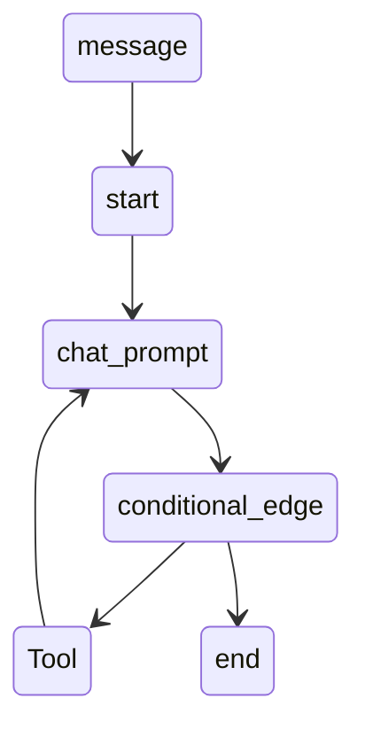

# LangGraph

This is where i will put everything i have learned about langGraph

---

## 1- getting started

### 1.1- prerequisite

- Python
- an openai API key (go to https://platform.openai.com and make an api key)

### 1.2- installation

- Make a **venv** using `python3 -m venu [name of venv]` and then we activate the venv `source [name of venv]/bin/activate`

- Use the following commands to install **langgraph** and **langchain** `pip install langgraph` and `pip install langchain-openai`

### 1.3- make your first project

Make a **.ipynb** file and pase this block of code

```python
from typing import Annotated, Literal
from typing_extensions import TypedDict
from langgraph.graph import StateGraph
from langgraph.graph.message import add_messages
from langgraph.prebuilt import ToolNode
from langchain_core.tools import tool
from langchain_openai import ChatOpenAI
```

this block of code contains all necessary imports

#### Good luck

---

## 2- Learning

### 2.1- references/videos

- https://www.youtube.com/watch?v=1Q_MDOWaljk <font color="red"> 8 min short explanation good enough to get started </font>

- https://www.youtube.com/watch?v=jGg_1h0qzaM <font color="red"> 3 hour in depth explanation </font>

---

## 3- Working Examples with state diagrams

### 3.1- Weather chatbot

just a simple chat bot that tells you the weather thats it


